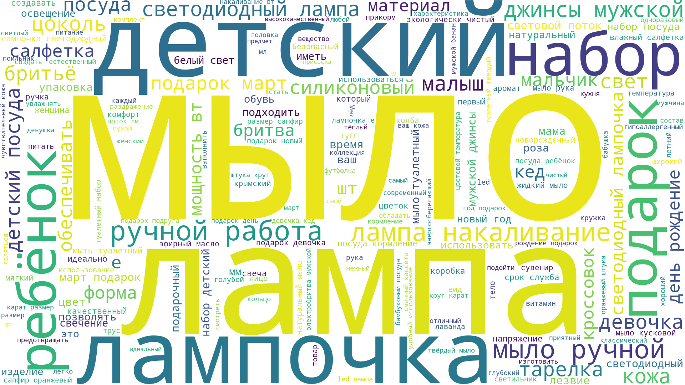

# Аналитика товаров на маркетплейсе
____
### Data: https://drive.google.com/drive/folders/1P_aWnUw3GxRXWuzZbhTCdT5gCBPy_b7l?usp=sharing  
https://drive.google.com/file/d/1ytobkQs0sEdfBJtTf9gl24GCt55-3TiN/view?usp=sharing - csv со всеми 16к товарами  
____

### image_regression.py
инференс выдает значение в диапазоне 0-1, которое характеризует успешность продающей картинки в данном сегменте.

<b> 1 - максимальный успех </b> 

____

### text_regression.py
инференс выдает значение в диапазоне 0-1, которое характеризует успешность продающего текста (описания товара) в данном сегменте.

<b> 1 - максимальный успех </b> 

____

### get_analytics.py
анализирует ближайших конкурентов по нескольким параметрам и передает данные для визуализации на фронте и текстовые рекомендации, а также генерирует изображение: облако слов из опианий ближайших товаров
```python
import json
from get_analytics import get_analytics

json_data = json.load(open("resule_parsing.json", "r", encoding="utf-8"))
our_product = json_data[20] # берем информацию о любом товаре для примера

analytic = get_analytics(our_product, create_worldcloud=True)
```

Примерный формат результата
```json
{
  ...,
  "price_analytic": {
    "comment": "Выша цена: 2590.0. Средняя цена в среди похожих товаров: 957.02; Цена у товаров с наибольшей выручкой: 1458.8",
    "personal_comment": "Возможно, Вам стоит понизить цену или усилить маркетинговую часть, чтобы донести клиентам ценность продукта. Мы поможем Вам это сделать с помощью AI технологий",
    "nearest_prices": [
      1234,
      1000,
      ...
    ]
  },
  ...
}  

```
точный пример ответа хранится в 

файл-изображение с облаком слов хранится в tmp_files/world-cloud.png 




